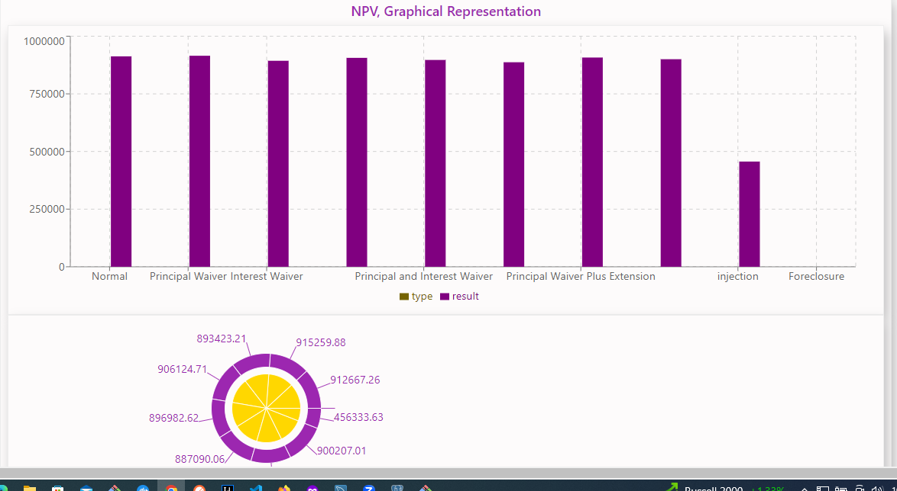
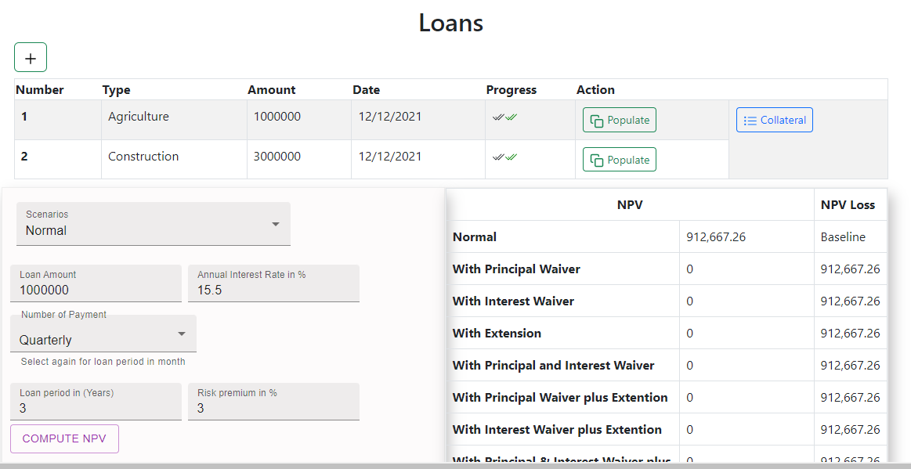
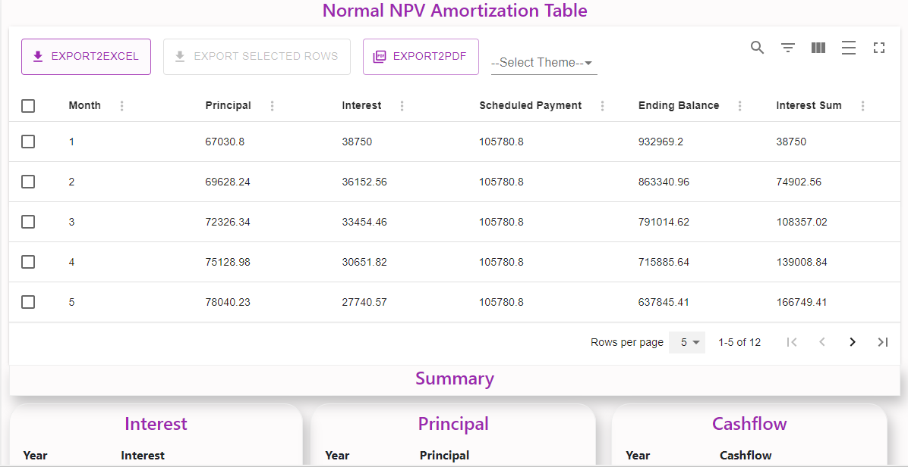

# NPV TOOL

**Net present value (*NPV*)** is the present value of the cash flows at the required rate of return of company credits compared to the initial investment. In practical terms, it’s a method of calculating company return. on investment for their borrowers. By looking at all of the money you expect to make from the investment and translating those returns into today’s and future money, you can decide whether the project is worthwhile.
## Screenshoots
- Graphicall Representation of NPV results with diferent scenarios such as normal, extension, waiver, ...


- Normal NPV parameters with its computation result,


- Amortization table for Normal NPV


## Where can we get more information about the TOOL

 - Click this [NPV link](https://gama1221.github.io/npv/#) to learn more about the NPV tool.

 ### Developers

 - [**Getinet Amare** on LinkedIn ](https://www.linkedin.com/in/getinet-mekonnen)
    ```github
    https://www.linkedin.com/in/getinet-mekonnen
    ```
 - [**Asefa Mulu** on LinkedIn ](https://www.linkedin.com/in/getinet-mekonnen)

## Installation

1. Copy the following line and past on gitbash 

    ```github 
    git clone https://github.com/gama1221/loan.git
    ```
2. go to NPV_TOOL_FRONTEND directory and open using text editor such as vscode also run the following on console
    ```npm
    npm install
    ```
3. go to NPV_TOOL_BACKEND directory open it using IntelliJ IDE and install maven
4. Insert sample data on MYSql database test the result by typing the following address
    ```
    http://localhost:8182/loan/1
    
    ```
## Config
- **Backend**
    ```java
    server.port=9999
    spring.datasource.url=jdbc:mysql://localhost:3306/npv_p_db?useSSL=false
    spring.datasource.username=root
    spring.datasource.password=npv_tool_@0123
    spring.datasource.driver-class-name=com.mysql.cj.jdbc.Driver
    spring.jpa.properties.hibernate.dialect=org.hibernate.dialect.MySQL8Dialect
    spring.jpa.show-sql=true
    spring.jpa.hibernate.ddl-auto=update
    spring.jpa.properties.hibernate.show_sql=true
    ```
- **Frontend**
    ```js        
    "scripts": {
        "start": "set PORT=8182 && react-scripts start",
        "build": "react-scripts build",
        "test": "react-scripts test",
        "eject": "react-scripts eject"
    }
    ```
## Licensing
- ALX_AFRICA

